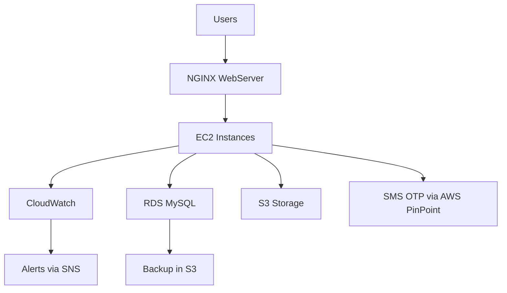

# ☁️ KloverBuy AWS Cloud Infrastructure  

This document outlines the **AWS cloud services** used in **KloverBuy** to ensure high availability, security, and performance for its e-commerce platform.

---

## 🌟 **Why AWS for KloverBuy?**  

AWS provides a **scalable, secure, and cost-effective** infrastructure for hosting **KloverBuy**, offering:  
✔ **Reliable infrastructure** to handle high-traffic shopping experiences.  
✔ **Data security & compliance** with IAM and encryption policies.  
✔ **Optimized cost management** for efficient cloud resource usage.  

---

## 🚀 **AWS Services Used in KloverBuy**  

### 🔹 **1. EC2 (Elastic Compute Cloud)**
- **Purpose**: Hosts backend **Node.js** services & frontend React app.  
- **Configuration**:
  - Instance Type: `C6a.large` for production.
  - **Ubuntu 22.04** OS.
  - **Nginx reverse proxy** for efficient load handling.

---

### 🔹 **2. RDS (Relational Database Service)**
- **Purpose**: Stores product details, user data, and transactions.  
- **Configuration**:
  - **MySQL 8.0** for structured relational data.
  - **Multi-AZ Deployment**: Ensures **high availability** and **failover**.
  - **Automated backups** for disaster recovery.

---

### 🔹 **3. S3 (Simple Storage Service)**
- **Purpose**: Stores product images, logs, and database backups.  
- **Features**:
  - **Bucket Policies** to restrict unauthorized access.
  - **Lifecycle Policies** to **automatically archive** older files.
  - **Versioning Enabled** to prevent accidental data loss.

---

### 🔹 **4. IAM (Identity and Access Management)**
- **Purpose**: Manages **secure access** to AWS resources.  
- **Configuration**:
  - Role-based **access control** for EC2, RDS, and S3.
  - **Multi-Factor Authentication (MFA)** for sensitive actions.
  - **Least privilege principle** applied to users & services.

---

### 🔹 **5. CloudWatch**
- **Purpose**: Monitors system **performance & application logs**.  
- **Use Cases**:
  - **Monitors EC2 & RDS** health metrics.
  - **Detects performance bottlenecks** and errors.
  - **Integrated with SNS** for real-time notifications.

---

### 🔹 **6. SNS (Simple Notification Service)**
- **Purpose**: Sends alerts and notifications for system events.  
- **Use Cases**:
  - **Critical infrastructure alerts** for database failures or high CPU usage.
  - **Order status notifications** for customers.
  - **Integrated with CloudWatch** for automated alerts.

---

### 🔹 **7. PinPoint (For SMS OTP Authentication)**
- **Purpose**: Provides **secure login authentication** for users.  
- **Use Cases**:
  - **One-Time Passwords (OTP) via SMS** for user authentication.
  - **Transactional alerts** (e.g., order confirmations).

---

### 🔹 **8. Shell Scripts**
- **Purpose**: Automates system maintenance and deployments.  
- **Use Cases**:
  - **Backup scripts** for database and S3 storage.
  - **Deployment scripts** for application updates.

---

## 📊 **AWS Cloud Infrastructure Architecture**  

