```mermaid
flowchart LR
    A[Code Push to GitHub] -->|Trigger Pipeline| B[Checkout Code]
    B --> C[SonarQube Analysis]
    C --> D[Quality Gate Check]
    D --> E[Build & Test]
    E --> F[Build Docker Image]
    F --> G[Push to Docker Hub]
    G --> H[Manual Approval]
    H --> I[Deploy to AWS EC2]
    I --> J[Email Notification]
```

# 🛠️ Jenkins CI/CD Pipeline for KloverBuy 🗜️  

This documentation outlines the **Jenkins CI/CD pipeline** configuration for the **KloverBuy** project. The pipeline automates **build, testing, security scanning, and deployment** processes using industry-standard DevOps practices.

---

## 🌟 **Pipeline Overview**  

The **Jenkins pipeline** for **KloverBuy** ensures a seamless **CI/CD workflow** by integrating various DevOps tools. The pipeline includes the following stages:

1️⃣ **Clean Workspace** – Removes previous build files for a fresh execution.  
2️⃣ **Checkout Code** – Fetches the latest code from **GitHub**.  
3️⃣ **Code Quality Analysis** –  
   - Uses **SonarQube** for **static code analysis**.  
   - Implements **Quality Gates** to enforce coding standards.  
4️⃣ **Build & Test Application** – Installs dependencies and runs automated tests.  
5️⃣ **Docker Image Build** – Packages the application into a **Docker container**.  
6️⃣ **Push to Docker Hub** – Uploads the **Docker image** to a private/public registry.  
7️⃣ **Manual Approval** – Requires **manager approval** before deployment.  
8️⃣**Deploy to AWS EC2** – Pulls the **latest Docker image** and deploys it to **AWS**.  
9️⃣ **Send Email Notifications** – Sends **deployment status reports** to the team.  


---

## 🛠️ **Tools & Integrations**  

| **Tool**       | **Purpose** |
|---------------|------------|
| **GitHub**   | Version control for the source code. |
| **Jenkins**  | Automates the CI/CD pipeline. |
| **SonarQube** | Static code analysis for quality enforcement. |
| **Docker**   | Containerization for consistent deployments. |
| **AWS EC2**  | Hosts the application in a cloud environment. |
| **SSH**      | Securely connects to the **remote server** for deployment. |
| **Email**    | Sends notifications with logs and deployment status. |

---

## ⚙️ **Pipeline Stages Explained**
<details>
<summary>Click to expand Jenkinsfile</summary>

### **1. Clean Workspace**
- Clears previous build artifacts to ensure a clean environment:
```groovy
cleanWs()
```

### **2. Checkout Code from GitHub**
- Fetches the latest code from the GitHub repository:
```stage('Checkout Code') {
    steps {
        checkout([$class: 'GitSCM',
                  branches: [[name: 'main']],
                  userRemoteConfigs: [[url: 'https://github.com/KloverBuy.git',
                                       credentialsId: 'GitHub-Credentials']]
        ])
    }
}
```
### **3. SonarQube Code Analysis**
- Performs static code analysis and enforces quality gates:
```stage('SonarQube Analysis') {
    steps {
        withSonarQubeEnv('Sonar-Server') {
            withCredentials([string(credentialsId: 'Sonar-Admin-Token', variable: 'SONAR_TOKEN')]) {
                sh '''
                /opt/sonar-scanner/bin/sonar-scanner \
                -Dsonar.projectKey=KloverBuy \
                -Dsonar.sources=. \
                -Dsonar.host.url=${SONARQUBE_URL} \
                -Dsonar.token=${SONAR_TOKEN}
                '''
            }
        }
    }
}
```
### **4. Quality Gate Enforcement**
- Validates that the code meets SonarQube quality gates:
```stage('Quality Gate') {
    steps {
        script {
            timeout(time: 5, unit: 'MINUTES') {
                waitForQualityGate abortPipeline: true
            }
        }
    }
}
```
### **5. Install Dependencies & Run Tests**
- Installs Node.js dependencies using **npm**:
```stage('Build & Test') {
    steps {
        sh '''
        npm install
        npm test
        '''
    }
}
```
### **5.  Build Docker Image**
- Builds and tags the Docker image:
```stage('Build Docker Image') {
    steps {
        script {
            def imageTag = "${env.BUILD_NUMBER}"
            sh "docker build -t kloverbuy-api:${imageTag} ."
            sh "docker tag kloverbuy-api:${imageTag} kloverbuy-api:latest"
        }
    }
}
```
### **6.  Push Docker Image to Docker Hub**
- Pushes the Docker image to Docker Hub:
```stage('Push Docker Image') {
    steps {
        withCredentials([usernamePassword(credentialsId: 'DockerHub-Credentials', usernameVariable: 'DOCKER_USER', passwordVariable: 'DOCKER_PASSWORD')]) {
            sh '''
            echo "${DOCKER_PASSWORD}" | docker login -u "${DOCKER_USER}" --password-stdin
            docker push kloverbuy-api:${env.BUILD_NUMBER}
            docker push kloverbuy-api:latest
            '''
        }
    }
}
```
### **7.  Manual Approval**
- Requires manual approval from "Product Manager":
```stage('Approval') {
    steps {
        script {
            def userInput = input(
                message: 'Approve deployment to AWS?',
                submitterParameter: 'APPROVER',
                parameters: [booleanParam(name: 'APPROVE_DEPLOYMENT', defaultValue: false)]
            )

            if (!userInput) {
                error "Deployment not approved."
            }
        }
    }
}
```

### **8.  Deploy to AWS EC2**
- Deploys the Docker image to a remote server:
```stage('Deploy to AWS') {
    steps {
        withCredentials([usernamePassword(credentialsId: 'AWS-EC2-Credentials', usernameVariable: 'EC2_USER', passwordVariable: 'EC2_PASSWORD')]) {
            sh '''
            sshpass -p "${EC2_PASSWORD}" ssh -o StrictHostKeyChecking=no ${EC2_USER}@ec2-instance-ip "
            docker stop kloverbuy-container || true && docker rm kloverbuy-container || true
            docker pull kloverbuy-api:latest
            docker run -d --name kloverbuy-container -p 5000:5000 kloverbuy-api:latest
            "
            '''
        }
    }
}
```
### **9.  Send Deployment Notification**
- Deploys the Docker image to a remote server:
```stage('Send Email Notification') {
    steps {
        emailext(
            to: 'devops-team@kloverbuy.com',
            subject: 'KloverBuy Deployment Status',
            body: 'The latest build of KloverBuy has been deployed successfully!',
            attachLog: true
        )
    }
}
```
</details>

## 📊 **Jenkins Pipeline Diagram**

---
## 🎓 **Key Features**

1. **Automated CI/CD Workflow:** Streamlines build, test, and deployment processes.
2. **Secure Deployments:** Vulnerability checks with Trivy.
3. **Code Quality:** Enforced with SonarQube.
4. **Manual Approval:** Ensures controlled deployments to production.
5. **Automated Notifications:** Keeps the team informed with detailed logs.

---

## 🏆 **Conclusion**
#### This Jenkins pipeline ensures a secure, automated, and reliable CI/CD process for KloverBuy. By integrating SonarQube, Docker, and AWS, it enhances code quality, security, and deployment efficiency. 🚀