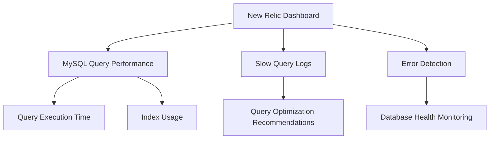

# 📊 New Relic Configuration for KloverBuy

This document explains the integration of **New Relic** in the **KloverBuy** project. **New Relic** is used for real-time **application performance monitoring (APM)** and **MySQL database optimization** to enhance system efficiency and stability.

---

## 🚀 What is New Relic?

**New Relic** is an **application performance monitoring (APM) tool** that helps **monitor, diagnose, and optimize** applications and infrastructure. It provides **real-time insights** into system performance, helping **DevOps engineers** and **developers** proactively resolve issues before they impact users.

### 🔹 Key Features of New Relic
- **Real-time application monitoring**  
- **Database performance optimization**  
- **Error tracking and debugging**  
- **Distributed tracing for microservices**  
- **Infrastructure health analysis**  
- **Custom alerts for performance anomalies**  

---

## 🎯 Why is New Relic Important in Production Environments?

In a **production environment**, maintaining application stability and performance is **crucial**. New Relic plays a **vital role** in ensuring high availability and performance by:

### **1️⃣ Performance Monitoring**
- Tracks **response time, throughput, and database queries** to optimize system performance.  
- Detects **slow API endpoints** and **inefficient database queries** that can affect user experience.  

### **2️⃣ Proactive Issue Detection**
- Identifies performance **bottlenecks and slow queries** before they impact users.  
- Provides **real-time alerts** on performance degradation.  

### **3️⃣ Error Tracking & Logging**
- Captures **detailed error logs** for debugging application issues.  
- Helps in **root cause analysis** for quick resolution.  

### **4️⃣ Infrastructure Health Monitoring**
- Monitors **server CPU, memory, disk usage, and network performance**.  
- Prevents **server downtime** by identifying and resolving resource constraints.  

---

## 📌 New Relic Use Case in KloverBuy Project

In the **KloverBuy** project, **New Relic** is integrated specifically for **MySQL database performance optimization**. This ensures that **database queries are optimized**, reducing **latency and improving application speed**.

### 🔍 How KloverBuy Uses New Relic
✅ **MySQL Query Optimization**: Identifies **slow and inefficient queries**, helping **optimize indexes** and **query execution plans**.  
✅ **Database Health Monitoring**: Tracks **CPU utilization, slow queries, locks, and memory usage**.  
✅ **Query Performance Analysis**: Helps **fine-tune** queries to ensure faster response times.  
✅ **Real-time Alerts for Slow Queries**: Triggers **alerts when queries exceed the threshold limit**, enabling **proactive resolution**.  
✅ **Error Detection & Debugging**: Logs **database errors and deadlocks** to prevent failures.  

---

## 🛠️ New Relic Integration in KloverBuy
<details>
<summary>Click to expand</summary>

### **1️⃣ Install New Relic Agent**
To integrate **New Relic APM**, install the New Relic agent in the **Node.js backend**:

```bash
npm install newrelic --save
```
### **2️⃣ Configure New Relic Agent**
Create a newrelic.js file in the root directory:
```js
exports.config = {
  app_name: ['KloverBuy'],
  license_key: 'YOUR_NEW_RELIC_LICENSE_KEY',
  logging: {
    level: 'info'
  },
  rules: {
    ignore: [/health-check/]
  }
};
```
### **3️⃣ Enable MySQL Monitoring**
Modify newrelic.js to enable MySQL query tracking:
```bash
config.transaction_tracer.record_sql = 'obfuscated';
config.transaction_tracer.explain_threshold = 500;  // Queries exceeding 500ms will be logged
```
### **4️⃣ Import New Relic in Application**
Modify server.js to include New Relic:
```bash
require('newrelic'); // Load New Relic before anything else
const express = require('express');
const app = express();
```
</details>

## 📊 **New Relic Dashboard Visualization**


---
## 🏆 **Benefits of New Relic in KloverBuy:**
* ✔️ **Optimized MySQL queries for better response time.**
* ✔️ **Improved application performance with proactive monitoring.**
* ✔️ **Reduced downtime through real-time database health tracking.**
* ✔️ **Faster debugging with query logs and alerts.**
* ✔️ **Enhanced user experience by minimizing slow queries.**

---
## 🛠️ **Conclusion:**

**Integrating New Relic in KloverBuy provides real-time performance monitoring and MySQL query optimization, ensuring a fast, stable, and highly available application. With its powerful analytics and proactive alerts, New Relic helps DevOps engineers and developers keep the system running at peak efficiency.**
